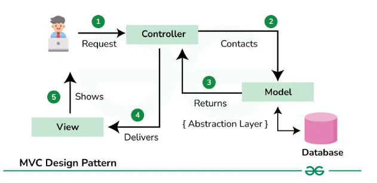
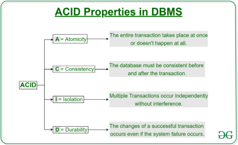
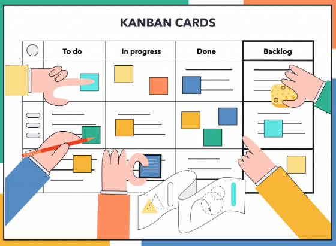
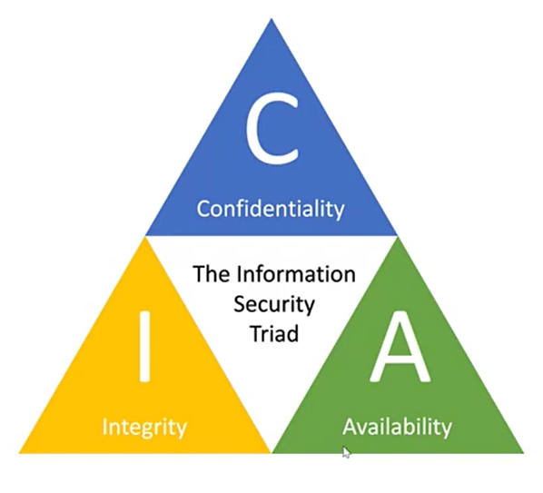
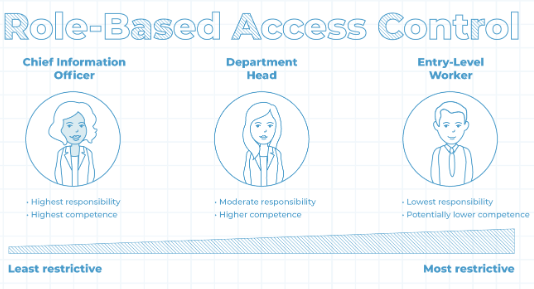
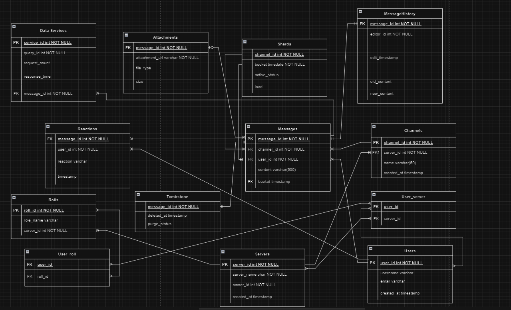

# NathanKeen_T2A1-A

# Q1 
Software architecture is a way that we can describe software systematically and also refers to how different software interact with each other.  One of the most popular Software architectures is Model-View-Controller(MVC).  
<br>  
MVCs' design patern divides any application into three interconnected components, allowing for effecient code organisation, easier maintenance and scalability. 

*MVC Architecture Diagram*  

## The Model  
The Model component is resposible for managing the application's data related logic, such as the schema's and interfaces of the project.  It interacts with the database to define the data structure and retrieves, manipulate and store data.  It acts as a middleman between the database and the controller.

## The View
The View component handles the presentation part of the application with things that the user can interact with, such as text boxes, dropdowns etc.  Its primary role is to displays the data, and sends all the inputs from the user to the Controller component.  

## The Controller  
The controller component acts as the go-between for the Model and View components.  It handles and processes the user inputs then determines what data from the *model* will be displayed in the *View*.  

## Benifits of MVC
The benefits of this architecture is that it separates each component making it easier to maintain and organise code by setting clear responsibilties for each.  By separating each part, it can be developed, scaled, and tested independently.  

### References 
* Web Dev Simplified (2019). MVC Explained in 4 Minutes. YouTube. Available at: https://www.youtube.com/watch?v=DUg2SWWK18I.
* Kumar, N. (2021). How the Model View Controller Architecture Works – MVC Explained. [online] freeCodeCamp.org. Available at: https://www.freecodecamp.org/news/model-view-architecture/.
* GeeksforGeeks (2018). MVC Design Pattern - GeeksforGeeks. [online] GeeksforGeeks. Available at: https://www.geeksforgeeks.org/mvc-design-pattern/.
* Martin, M. (2019). MVC Tutorial for Beginners: What is, Architecture & Example. [online] Guru99.com. Available at: https://www.guru99.com/mvc-tutorial.html.

# Q2 

# PostgreSQL
PostgreSQL, while one of the oldest, is still one of the most advanced Relational Database Management Systems out there.  It is open source, meaning it is managed and maintained by a vibrant community of people and the source code is available to anyone under the PostgreSQL licence.  

## Pros 
1. *Transactions*:  
    - PostgreSQL supports transactional DDL(Data Definition Language), which allows for complex relational applications to make schema changes and other operations in a single transaction.  With this feature it reduces the need for extensive error handling code, which simplifies developement and enhances reliability.  

2. *ACID Compliance*: 
    - PostgreSQL is ACID (Atomicity, Consistency, Isolation, Durability) compliant. This means it ensures that transactions are reliable so your data remains secure and accurate.  

      

3. *Extensibility*:  
    - It is highle extensible, this allows developers to add custom functions, languages and data types.  This flexibility allows for a more tailored approach for specific needs when creating specilised or complex projects.  

4. *Security*:  
    - PostgreSQL offers powerful security features, including support for user priviledges and the ability to lock down enviroments at the OS level.  This makes it useful for applications that require a high level of security, such as those handling sensitive data.  

5. *Open Source and Community Support*:  
    - As an open-source database, PostgreSQL benefits from a vibrant community that actively maintains and supports it. This community-driven model ensures continuous improvement and quick resolution of issues.  

6. *Platform Compatibility*:  
    - PostgreSQL is compatible with various platforms, including Windows, Linux, and Mac. This cross-platform support makes it versatile for deployment in different environments.  

## Cons

1. *Database Structure*:  
    - PostgreSQL is predominantly a relational database, meaning it works with structured data in predefined schemas.  This can be limiting when dealing with unstructured or semi structured data, where as NoSQL databases like MongoDB might be more flexible.  

2. *Open Source Limitations*:
    - While open source is generally an advantage, it also means that PostgreSQL lacks the commercial support and warranties that come with branded software.  This can be a drawback for businesses that require guaranteed support or liability protection.  

3. *Slower Performance*:  
    - When handling very large datasets, particulary when there are complex queries involving many rows and colomns, PostgreSQL's performance can degrade.  This slower performance can be a concern in high-speed, large-scale applications where rapid query execution is critical.  

4. *Complexity*:  
    - PostgreSQL can be more complex to set up and maintain because of its advanced features, especially for those who are unfamiliar with it.  This complexity might slow down developement with its learning curve for new users.  

## Conculsion
For Flask applications, PostgreSQL can be a powerful and flexible database option.  However, it might not be the best choice for projects that need rapid developement, simple setup, or working with unstructured data, where as another database type might be better suited.  

### References
* Dhruv, S. (2019). Pros and Cons of using PostgreSQL for Application Development. [online] Aalpha. Available at: https://www.aalpha.net/blog/pros-and-cons-of-using-postgresql-for-application-development/.
* GeeksforGeeks. (2021). PostgreSQL Tutorial. [online] Available at: https://www.geeksforgeeks.org/postgresql-tutorial/?ref=shm
* Kinsta (2022). What Is PostgreSQL? [online] YouTube. Available at: https://www.youtube.com/watch?v=Yfrrjt1ieyk [Accessed 8 Sep. 2024].

# Q3 
Kanban was originally developed as part of the Toyota Production System in the 1940's and has became a popular Agile Software Developement methodology.  Its key function was as a signaling device to manage the flow of parts in a 'pull' production system.  With respect to software developement, Kanban helps teams to visualise their workflow, manage work in progress(WIP), and continuously improve process through incremental changes.  



## Key Concepts and Features  
1. **Kanban Board:**  
    - A Kankan board is a visual tool that represents the workflow of a project.  It is divided into different columns that state different phases of the developement process, such as "To-Do", "In-Progress", and "Done".  These Tasks are represented as cards, that move across the columns as they progress through the workflow.  
    - The board can be physical (eg. sticky notes on a whiteboard) or digital (eg. tools like Trello or Jira).  It provides a clear overview of the status of each task and helps identify where tasks might be stuck for too long.  
2. **Pull Systems:**  
    - Kanban operates with a pull system, which means tasks are only pulled into the workflow when there is a capacity to handle them.  The pull system helps prevent overloading team members and ensures a steady flow of work, reducing delays and improving efficiency.  
3. **Work-In-Progress (WIP) Limits:**  
    - One of the key practices in Kanban is to set WIP limits, this helps cap the number of tasks that can be in progress at any given time.  These limits help keep the team focused on completing tasks rather then statring new ones, which enhances productivity and reduces the likelihood of work getting stuck in the pipeline.  
4. **Kanban Principles:**  
    - *Start with the Existing Process:* Kanban emphasises beginning with the current process without drastic changes.  Instead, it focuses on making incremental, evolutionary improvements.  
    - *Agree to Incremental Changes:* Teams should aim for small, manageable changes rather than large-scale overhauls, which coulsd disrupt workflow and meet resistance.  
    - *Respect Current Roles and Responsibilities:* Kanban does not prescribe specific roles, allowing teams to maintain their current structure while gradually adoping the methodology.  
5. **Cumulative Flow Diagram (CFD):** A CFD is an advanced Kanban tool that provides a visual representation of the workflow over time.  It shows the distribution of tasks across different stages of the process, helping teams identify trends, predict bottlenecks, and make adjustments to improve workflow stability.  

## Steps of the Kanban Approach
1. **Visualise Workflow:**  
    - Map out the current process and define the stages of work.  Visualise these stages on a board, with tasks moving from left to right as they process.  
2. **Establish a Pull System:**  
    - Implement a pull system where work is only pulled into the next stage when there is the capacity to do so, preventing bottlenecks and ensuring smooth flow.  
3. **Set WIP Limits:** 
    - Define limits on how many tasks can be in each stage of the process at any time.  This will encourage teams to complete the tasks before starting new ones, enhancing focus and reduce mulitasking.  
4. **Apply Pull Signals:**  
    - Use signals to indicate when new tasks can be pulled into stage.  Such as, when a task is completed in one stage, it signals the team to pull a new task from the previous stage.  

In summary, using Kanban for API developement not only streamlines the workflow and enhances team productivity but also ensures that the project is delivered efficiently, with a strong focus on quality.  The flexibility, visibility, and continuous improvement principles of Kanban make it an ideal choice for managing the complexities and fast-paced demands of API projects.  


### References
* Google Cloud Tech (2021). Agile development approach for APIs. [online] YouTube. Available at: https://www.youtube.com/watch?v=36Mmyi65mko [Accessed 8 Sep. 2024].
* GeeksforGeeks. (2023). What is Kanban? [online] Available at: https://www.geeksforgeeks.org/what-is-kanban/.
* GeeksforGeeks (2022). Kanban - Agile Methodology. [online] GeeksforGeeks. Available at: https://www.geeksforgeeks.org/kanban-agile-methodology/.
* Hygger: Project Management Software & Tools for Companies. (2016). Online Kanban Board. [online] Available at: https://hygger.io/blog/online-kanban-board/.


# Q4 

# Source Control

Source Control, or version control, is a crucial component of mordern software developement, particulary for API projects.  It involves involves managing changes to code over time, ensuring that every modification is tracked, documented, and can be reviewed.  This process allows for multiple developers to collaborate efficiently, even when they are working in different locations, and ensures that the code remains organised,secure, and recoverable.  

## Key Components
1. **Repository:**  
    - The repository is like a database that stores all versions of the project.  It contains the complete history of all the changes made to the API's codebase, including who made the changes, when they were made, and why they were made.  The repository can be centralised (eg. with a system like Subversion) or distributed (eg. with Git).  
2. **Branches:**  
    - A branch is a parallel version of the code the diverges from the main repository.  In an API project, branches are typically used to develope new feature, fix bugs, or test changes without affecting the main codebase.  Developers work on their own branches and only merge their changes back into the main branch after a thorough review and testing has occured.  
3. **Commits:**  
    - A commit is an action that saves a snapshot of the developer's changes to the repository. Each commit includes a message describing what was changed and why, which helps in maintaining a clear historyof the project's progression.  
4. **Pull Requests:**  
    - When a developer wants to merge their changes from a feature branch into the main branch, they open a pull request.  This process allows the other team members to review the code, suggest improvements, or catch potential issues before the changes are integrated to the main codebase.  
5. **Push and Pull Operations:**  
    - In a distributed version control system, like Git, changes are first committed to the developer's local repository.  These changes are then pushed to the central repository so that they can be shared with others.  Conversely, a pull operation is used to fetch updates from the central repository into the local environment.  

## Standard Source Control Workflow for an API Project 
1. **Cloning the Repository:** Each developer clones the repository from the central repository to create a local copy on their machine.  This includes the entire history of the project and all the branches.  
2. **Creating a New Branch:** Before making any changes, developers create a new branch from the main.  This is typically named after the feature that the developer will be working on (eg.'feature/user-auth').  
3. **Developing and Committing Changes:** The developer will then make changes to the codebase.  Once the changes are ready, they are added to the staging area and then committed locally with a descriptive message.  
4. **Pushing the Branch:** After committing, the developer will push the branch to the central repository.  This makes the changes available for review by the rest of the team.  
5. **Creating a Pull Request:** The developer will then open a pull request, inviting other team members to review the changes.  The pull request should link to any relevent issues or tasks and include a detailed explanation of what has been changed.  
6. **Code Review and Testing:** The pull request is reviewed by other developers.  They may suggest improvements or request changes.  Once the review is complete, automated test are usually run to make sure the new code does not break existing functionality.  
7. **Merging the Branch:** Once the code has passed the review and testing stages, it is then merged into the main branch.  This step usually involves another review to ensure that the merge does not introduce conflicts.  
8. **Deleting the Branch:** After merging, the feature branch is deleted to keep the repository clean and focused on active branches.  

In summary, by implementing a standard source control process, API projects can maintain a high level of code quality, ensure seamless collaboration, and reduce the risk of errors in the production environment.

### References
* Atlassian (2019). What is Git: become a pro at Git with this guide | Atlassian Git Tutorial. [online] Atlassian. Available at: https://www.atlassian.com/git/tutorials/what-is-git.
* Soumya (2019). Version Control Systems. [online] GeeksforGeeks. Available at: https://www.geeksforgeeks.org/version-control-systems/.

# Q5 

# API Testing
API testing is a crucial component of software testing, it ensures the API functions as intended, providing reliable, secure and effient communication between the different software components.  While UI testing focuses on the look and feel of an application, API testing centers on the backend, notably the business logic, security, and the data response mechanisms.  

# API Testing Process
## 1. Define the Scope and Requirements
When beginning the API testing process, it is essential to define the scope and understanding of the API.  It is key to have a comprehensive understanding of how the API should function and what business logic it handles.  This requires identifying all the API endpoints that need to be tested, which includes the methods (such as GET, POST, PUT, DELETE) and the parameters that are associated with each.  It is also a good idea to define the expected HTTP response codes for both successful and unsuccessful requests, along with the corresponding error messages.  

## 2. Test Case Development
After the scope is defined, the next step involves developing test cases that will cover a wide range of scenarios, includeing normal, boundary and error conditions.  Each test case should specify input conditions, expected results and actual results to allow for thorough testing.  It is also important to include tests that will measure performance, such as response times and data integrity checks, and tests that validate authorisation and error handling.  Non-function features, like the API's ability to perform well under load, maintain security and operate reliably should aslo be tested.  

## 3. Execution of Test Cases
When the test cases are developed, execution of these tests can begin.  Automated testing tools like Postman, Insomnia or SoapUI are typically used to send requests to the API and validate the responses with the expected results.  These tests are particularly valuable in Agile environments, where continuous testing and fast feedback are essential.  However, manual testing still plays a part, especially for exploratory testingof areas not covered by automated scripts.  Manual tests are useful for newly introduced features that require a more-hands on aproach.  

## 4. Evaluation and Reporting
After executing the tests,  the results need to be thoroughly analyzed.  This involves comparing the actual results with the expected outcomes and identify any discrepancies.  If there are any failures, errors, or unexpected behaviors they should be logged and investigated further.  Performance and load texting are especially important at this stage to assess how well the API will handle increased loads and stress conditions.  Additionally, security validation is essential to check for vulnerabilities.  

## 5. Bug Fixing and Retesting
Once the issues are identifyed, they need to be tackled through a bug-fixing process.  Developers work on the bugs, and once they are fixed, the API is then retested to ensure the issues are resolved.  This step often includes testing to ensure that the new changes have not introduced new bugs or negatively impacted other parts of the API.  Continuous retesting help maintain the stability of the API as it evolves.  

## In Summary
By following these steps, developers can ensure that the API's are not only functional and reliable but also secure and efficient, which ultiately lead to higher qualtity software and improve customer satisfaction.  

### References
* Testsigma Blog. (2023). API Testing | What It is, How to Test & Best Practices. [online] Available at: https://testsigma.com/guides/api-testing/.
* caisy.io. (n.d.). API Testing: A Comprehensive Guide for Developers | caisy. [online] Available at: https://caisy.io/blog/api-testing-for-developers.
* SearchAppArchitecture. (n.d.). What is API testing and How to Use It? [online] Available at: https://www.techtarget.com/searchapparchitecture/definition/API-testing.

# Q6 

## Principles of Information System Security 
The three fundamental principles of information system security, also known as the *CIA triad*, are know as *Confidentiality, Integrity, and Availability*.  


## Confidentiality 
The confidentiality principle ensures that only those who have been authorised to access information can access it.  Confidentiality is a must in preventing unauthorised access to sensitive information, whether that be by implementing access control measures or by ensuring that data is being encrypted.  For example, a business's administration must not allowed access to employees private and sensitive information.  

## Integrity 
The principle of Integrity involves maintaining the accuracy and completeness of data.  This ensures that no information is altered in any unauthorised way, and that any changes to the data are made only by authorised personnel.  Techniques such as checksum and version control are often used to maintain data integrity by ensuring the information remains reliable and unaltered.  This will also ensure data is protected and not deleted, destroyed or lost.  

## Availability  
Availability means that resources and information are readily accessible to authorised users when needed.  This principle focuses more on the reliability and timely access to data and systems, which is key for business operations.  Implementing plans for regular maintenance and disaster recovery are commin practices to ensure availability.  

### References  
* Security, R.S.I. (2021). What are the Top Three Principles of Information Security? [online] RSI Security. Available at: https://blog.rsisecurity.com/what-are-the-top-three-principles-of-information-security/.
* GeeksforGeeks. (2020). Principle of Information System Security. [online] Available at: https://www.geeksforgeeks.org/principle-of-information-system-security/.
* www.youtube.com. (n.d.). Basic principles of Information Security | Confidentiality, Integrity, availability. [online] Available at: https://www.youtube.com/watch?v=tHgn2rhqChg [Accessed 14 Nov. 2022]. 

# Q7 

# Implementing Confidentiality Principle in an API Project

## Authentication
Authentication is the process of confirming the identity of a user or system that is attempting to access the API.  Without effective authentication, the API would be vulnerable to unauthorised access and potential misuse.  
1. **Basic Authentication:** 
    - A simple method where the client sends the username and password, which are sent as Base64-encoded credentials in the header of the HTTP, with every request.  However this is not recommended due to security concerns, as senitive data would be transmitted as plain text.   
* **Example:** 


2. **Token-Based Authentication:**  
    * Token-based authentication is a technique where users or applications are given tokens after successfully verifying their identity with a system. These tokens are used to access secured resources or execute actions on behalf of the authenticated user. This method offers greater security and scalability compared to traditional username/password authentication, as it avoids the need to send sensitive credentials with every request.  
    * **How it works:**  
        1. *User Authentication:* The process starts with authenticating the user, where the user logs in using their password and username.  The server then verifies these credentials.  Once comfirmed, the server creates a token linked to the user.  
        2. *Token Generation:* The server will then produce a token that includes details about the user, such as thier user ID and roles. This token is signed with a secret or private key,ensuring its integrity and authenticity. To enhance security, the token may also have an expiration time.  
        3. *Token Issuance:* After generating the token, the server sends it to the client. The client securely stores the token, typically in local storage,a cookie , or a mobile app’s secure storage.  
        4. *Token Usage:* For each request to the protected API endpoints, the client includes the token in the HTTP headers. The server then validates the token by checking its signature, expiration, and any claims within it.  
        5. *Access Control:* Once the token is validated, the server either grants or denies access to the requested resource based on the user’s identity and, if applicable, their roles or permissions.  
        6. *Token Expiry:* If the token has an expiration time and it expires, the client needs to re-authenticate with the server to obtain a new token.  

## Authorisation
Authentication verifies a user's identity, but it doesn't dictate their permissions. Authorisation, however, defines the actions a user is permitted to take once their identity has been authenticated.  
* **Role-Based Access Control (RBAC):**  
    - Role-Based Access Control (RBAC) is a widely used method for managing authorisation. This approach organises users into roles, with each role assigned a specific set of permissions. By using RBAC, you can regulate which users are allowed to carry out particular actions within your API.



### References
* Jaiswal, S. (2024). Securing RESTful APIs: Authentication and Authorization. [online] Medium. Available at: https://medium.com/@satyendra.jaiswal/securing-restful-apis-authentication-and-authorization-8194c982f12f.
* www.okta.com. (n.d.). What Is Role-Based Access Control (RBAC)? | Okta. [online] Available at: https://www.okta.com/identity-101/what-is-role-based-access-control-rbac/.

# Q8 

Developers of a social media website or application have several obligations regarding the handling of user data.  These obligations are primarily shaped by laws and regulations that focus on data privacy, security, and the rights of users. Down below are a list of these obligations, and reference to the appicable laws:  

1. **Transparency in Data Collection and Handling:**  
    - *Australian Privacy Principle (APP) 1 - Open and Transparent Management*   
    Developers must maintain a transparent and open approach in handling personal data.  This includes creating a clear and up-to-date **Privacy Policy** that details what types of personal information are collected, how it is collected, the purposes for its use, and how the users can access, correct, or complain about breaches related to the use of thier data.  This aligns with other laws such as the **General Data Protection Regulation (GDPR)** in the EU, that mandates transparency in data handling.  
2. **Consent for Data Collection:**  
    - *APP 3 - Collection of Personal Information*  
    Personal information must only be collected if it is necessary for the funtion of the application.  Sensitive information can only be collected with explicit consent.  If developers plan to collect sensitive data such as health information, they must ensure that consent is obtained first.  
3. **Anonymity and Pseudonymity Options:** 
    - *APP 2 - Anonymity and Pseudonymity*  
    Users have to be given the option to interact with the platform anonymously or by using a pseudonym unless it impractical for the app to function without knowing the user's identity or it is legally required for indentification.  This supports user privacy and limits the exposure of the personal details.  
4. **Fair and Lawful Collection of Data:**  
    - *APP 3.5 - Lawful Collection*  
    Data collection must be carried out in a lawful and fair manner.  The GDPR, in the EU, also stresses that personal data must be collected for legitimate purposes, and should not be processed futher in a manner unsuitable with these purposes.  
5. **Handling Unsolicited Personal Information:**  
    - *APP 4 - Unsolicited Data*  
    If a developer recieves any unsolicited personal information, such as information they did not request from the user, they must assess whether or not they could have collected the data lawfully.  If not, the data has to be destroyed or de-identified.  
6. **User Notification:**  
    - *APP 5 - Notification of Data Collection*  
    As with the GDPR, developers must inform users about the collection,purpose, and potential recipients of thier personal data either at the time of data collection, or as soon as possible.  
7. **Use and Disclosure of Data:**  
    - *APP 6 - Purpose Limitation for Data Use*  
    Unless the user consents or other legal exceptions apply, personal data collected for a specific purpose(like account creation) must not be used for a second purpose(like marketing).  
8. **Cross-Border Disclosure:**  
    - *APP 8 - Cross-border Disclosure of Personal Information*  
    If a users personal information is transferred to a foreign country, developers must take steps to ensure the recipient complies with privacy protections that are similar to ours.  This aligns with GDPR's data tranfer restrictions which ensures data sent outside the EU is protected by sufficient privacy standards.  
9. **Data Security:**  
    - *APP 11 - Security of Personal Information*  
    Developers must take reasonable steps to protect personal information from interference, loss, misuse, unauthorised access, modification, or disclosure.  When data is no longer needed, they must ensure its secure deletion.  This is also mirrored in the GDPR to safeguard data.  
10. **Access and Correction Rights:**  
    - *APP 12 and 13 - Access to and Correction of Personal Information*  
    Users have the right, on a social media platform, to access thier personal information and request corrections if the data is inaccurate, outdated, or misleading.  
11. **Direct Marketing Restrictions:**  
    - *APP 7 - Direct Marketing*  
    Developers cannot use personal data for direct marketing without the user's consent unless there is a specific condition applying.   
By adhering to these principles, developers ensure that their social media applications comply with relevant legal frameworks, protecting user privacy and avoiding potential legal liabilities. For companies operating globally, compliance with regional laws like the Australian Privacy Principles and GDPR is crucial.  


### References
* Office of the Australian Information Commissioner (2024). The Privacy Act. [online] OAIC. Available at: https://www.oaic.gov.au/privacy/privacy-legislation/the-privacy-act.
* OAIC (2019). Australian Privacy Principles. [online] OAIC. Available at: https://www.oaic.gov.au/privacy/australian-privacy-principles/read-the-australian-privacy-principles.
* Potter, A., Nazareth, C., Stylianou, T., Ashcroft, V., Co, C., Christie, J. and Wong (2022). Contributors OneTrust DataGuidance TM. [online] Available at: https://www.dataguidance.com/sites/default/files/gdpr_v_australia_update_2022.pdf#:~:text=Given%20the%20Australian%20practice%20of%20using%20the%20Australian%20Privacy%20Principle.

# Q9 
Originally proposed by E.F. Codd, the relational database model is a widely used data model that organises data into **tables**(also known as relations), that represent both the data and the relationships between data.  This model is the foundation for most modern database systems such as Oracle, MySQL, and SQL Server.  The structural aspects of a relational database include several key components and constraints that define how data is stored and related.  

## Key Structural Aspects:  
1. **Tables (Relations):**  
    - *Data Representation:* In a relational database, data is stored in tables, which are essentially collections of related data.  Each table is structured into rows and colunms.  
    - *Rows (Tuples):* Each row in a table represents a single record, often referred to as a tuple.  For example, in a **STUDENT** table, each row might represent a different student.  
    - *Columns (Attributes):* Each column in a table represents an attribute, which defines a specific property of the data.  For example, in the **STUDENT** table, colunms might contain attributes like **ROLL_NO**, **NAME**, **ADDRESS**, **PHONE** and **AGE**.  Each of these columns has a specified Data type, like **VARCHAR** for text, or **INTEGER** for numbers, this ensures data consistency.  
    - *Relation Schema:* The structure of the table, which includes the table name and all of its attributes, is called the relation schema.  For example, the schema for the **STUDENT** table would be **STUDENT (ROLL_NO, NAME, ADDRESS, PHONE, AGE)**.  
2. **Keys:**  
    - *Primary Key:* A primary key is a column(or combination of colomns) that uniquely identifies each row in a table.  Like in the example, **ROLL_NO** in the **STUDENT** table serves as the primary key.  This that every student has a unique identifier, which prevents duplicate records.  
    - *Foreign Key:* A foreign key is a feild in the table that references the primary key in another table, thus creating a relationship between the two tables.  This enforces referential integrity, that ensures a record in the child table(e.g. **STUDENT**), relates to an existing record in the parent table(E.G. **COURSE**).  
3. **Relations:**  
    - Relationships between tables are established using primary keys and foreign keys, this ensures data is connected logically.  For instance, a **STUDENT** table may have a foreign key column **COURSE_CODE** that refers to the **COURSE_CODE** in a **COURSE** table.  This enforces the rule that ecery student is assigned a valid course.  
4. **Structural Constraints:**  
    - *Cardinality Ratios:* These define the number of entities in one table that can be associated with entities in another table.  Some common types of cardinality include:  
        - _One-to-One (1:1):_ Each row in one table relates to a single row in another table.  
        - _One-to-Many (1:N):_ A row in one table can relate to multiple rows in another table.  
        - _Many-to-One (N:1):_ Multiple rows in one table relate to a single row in another table.  
        - _Many-to-Many (N:N):_ Multiple rows in both tables can be related to multiple rows in the other table.  
    - *Participation Constraints:* These define whether an entitiy in a table must participate in a relationship.  Total participation means every entity must be part of a relationship, while partial participation means not all entities have to participate.  
5. **Null Values:** 
    - Columns in a table can have **NULL** values, that represent missing or unknown data.  For example, if a student's phone number is not available, the **PHONE** attribute in the **STUDENT** table could have a **NULL** value.  However, Primary key fields cannot be **NULL**, as they have to uniquely identify each row.
## Entiy Diagram Example 
.png>)  

## In Summary 
The relational database model uses tables to store data, with primary keys and foreign keys establishing relationships between tables. Structural constraints such as cardinality ratios and participation constraints ensure that the database maintains integrity, consistency, and accurate representation of relationships between entities. These features make the relational model both flexible and powerful for managing complex data sets efficiently.


### References
* sql-academy.org. (n.d.). Structure of Relational Databases. [online] Available at: https://sql-academy.org/en/guide/structure-of-relation-databases.
* GeeksForGeeks (2015). Relational Model in DBMS - GeeksforGeeks. [online] GeeksforGeeks. Available at: https://www.geeksforgeeks.org/relational-model-in-dbms/.
* GeeksforGeeks. (2020). Structural Constraints of Relationships in ER Model. [online] Available at: https://www.geeksforgeeks.org/structural-constraints-of-relationships-in-er-model/.


# Q10 

# Integrity Aspects of the Relational Database Model  
The relational database model guarantees the accuracy, reliability, and consistency of data through several integrity contraints.  These constraints act as rules that control how the data can be inserted, updated, or deleted in the database, which ensures the data adheres to certain standards.  

## Domain Intergrity  
Domain integrity refers to the rules that restrict the type, format, or range of values that can be stored in a particular column. Each column in a table is associated with a domain, defining the allowed data type (e.g., integer, string) and the range of acceptable values. This ensures that data entered into a column adheres to predefined rules.  
* **Enforcement:** Domain integrity is enforced through data types and **CHECK** constraints.  
* **Example:** 
    ```
        CREATE TABLE Employees (
            employee_id INT,
            name VARCHAR(50),
            age INT CHECK (age BETWEEN 18 AND 65)  -- Age must be between 18 and 65
        );
    ``` 
With this example, domain integrity is enforced by ensuring the "age" column accepts only integers between 18 and 65.

## Entity Integrity  
Entity integrity ensures that each table has a unique identifier, known as the primary key, and that this key cannot be null. The primary key uniquely identifies each row in a table, so allowing null values would violate this rule because it would make some rows unidentifiable.  
* **Enforcement:** Implemented using PRIMARY KEY constraints and NOT NULL constraints. The primary key ensures that each record is unique and identifiable.  
* **Example:**  
    ```
        CREATE TABLE Customers (
            customer_id INT PRIMARY KEY,   -- Primary key ensures uniqueness and non-null values
            name VARCHAR(50),
            email VARCHAR(100)
        );
    ```
Here, "customer_id" is the primary key, ensuring each customer has a unique ID and that no customer can have a null ID.  

## Referential Integrity  
Referential Integrity maintains consistency between related tables by ensuring that a foreign key in one table corresponds to a valid primary key in another table.  This type of constraint ensures that relationships between tables remain consistent, thus preventing the insertion of orphan records (i.e. records that reference non-existent entries in related tables).  
* **Enforcement:** Enforced using FOREIGN KEY constraints.  If a table contains a foreign key that references another table, any value in the foreign key column must match a valid primary key in the referenced table or be null.
* **Example:**  
    ```
        CREATE TABLE Orders (
            order_id INT PRIMARY KEY,
            order_date DATE,
            customer_id INT,
            FOREIGN KEY (customer_id) REFERENCES Customers(customer_id)  -- customer_id must exist in Customers table
        );
    ```  
In this example, "customer_id" in the "Orders" table must correspond to a valid "customer_id" in the "Customers" table. This ensures that each order is linked to an existing customer.  

## Key Integrity (Uniqueness Constraints)  
Key integrity, also known as uniqueness constraints, ensures that every row in a table is unique.  This is typically enforced through primary keys or unique keys, within the table, which prevent duplicate entries.  
* **Enforcement:** Enforced through PRIMARY KEY or UNIQUE constraints. A primary key must contain unique and non-null values, ensuring that no two rows have the same key values.  
* **Example:**  
    ```
        CREATE TABLE Products (
            product_id INT PRIMARY KEY,  -- Primary key for unique product identification
            product_name VARCHAR(50),
            sku VARCHAR(50) UNIQUE       -- SKU must be unique across the table
        );
    ```
In this case, the "sku" field must be unique across all products, ensuring that no two products can have the same SKU.  

## Detailed Example of Referential Integrity with Code  
Elaborating on referential integrity with a more complex example, including code for multiply tables and relationships.  
* **Example:**  
    ```
        -- Creating the Customers table with customer_id as the primary key
        CREATE TABLE Customers (
            customer_id INT PRIMARY KEY,
            customer_name VARCHAR(100) NOT NULL
        );

        -- Creating the Orders table with customer_id as a foreign key
        CREATE TABLE Orders (
            order_id INT PRIMARY KEY,
            order_date DATE,
            customer_id INT,
            FOREIGN KEY (customer_id) REFERENCES Customers(customer_id)  -- Ensures customer exists
        );

        -- Inserting a customer
        INSERT INTO Customers (customer_id, customer_name) VALUES (1, 'John Someone');

        -- Inserting a valid order referencing an existing customer
        INSERT INTO Orders (order_id, order_date, customer_id) VALUES (1001, '2024-09-06', 1);

        -- Attempt to insert an order with a non-existent customer (would fail)
        INSERT INTO Orders (order_id, order_date, customer_id) VALUES (1002, '2024-09-07', 2);
    ```
*In this example:*  
* Customers table has a primary key on "customer_id."  
* Orders table has a foreign key "customer_id" that references the Customers table.  
* The insertion of an order for a non-existent customer (e.g., customer_id = 2) will fail, preserving referential integrity.  

## Conclusion  

Relational database model enforces integrity through several constraints:  
* Domain Integrity ensures valid data types.  
* Entity Integrity guarantees unique and non-null identifiers.  
* Referential Integrity ensures valid relationships between tables.  
* Key Integrity enforces uniqueness.  
By using these integrity constraints and utilising SQL to enforce them, relational databases ensure that data remains accurate, secure, and consistent.  This helps to prevent issues with duplicate records, orphan data, and inconsistent relationships in the database.  

### References
* www.knowledgehut.com. (n.d.). What are Integrity Constraints in DBMS? [online] Available at: https://www.knowledgehut.com/blog/database/integrity-constraints-in-dbms.
* Dutta, B. (2020). Constraints on Relational database model. [online] GeeksforGeeks. Available at: https://www.geeksforgeeks.org/constraints-on-relational-database-model/.

# Q11 

## Manipulative Aspects of the Relational Database Model 
The relational database model structures data in tables(also known as relations), where in each table consists of rows(records) and columns(attributes).  Data manipulation in this model revolves around the creation, modification, retrieval, deletion of data using structured methods and operations.  These actions are performed using SQL(Structured Query Language), which is the standard language for managing and interacting with relational databases.  The four main data manipulationoperations are encapsulated by CRUD(Create, Read, Update, Delete) operations.  

1. **Adding Data (Create)**  
    - In the relational database model, adding new data is achieved by inserting new rows into existing tables.  To do this we use the SQL statement **INSERT INTO**, where data points are assigned to specific columns in a table.  The process of adding data ensures that each new record sticks to the table's schema, which defines the structure and contraints of the data.  
    - **Example SQL adding data**  
    ```
        INSERT INTO Customers (customer_id, customer_name, email)  
        VALUES (1, 'John Someone', 'john@email.com');  
    ```  
    This operation creates a new entry in the Customers table with the given details.  

2. **Retrieving Data (Read)**  
    - To retrieve data from a relational database involves the tables to extract specific information based on the users defined criteria.  This is achieved through the **SELECT** statement in SQL, this allows the users to filter, sort, and bundle data.  The relational model excels in retrieving data across multiple tables by using the **JOIN** operations, Which links tables based on common attributes, like primary and foriegn keys.  
    - **Example SQL retrieving data**  
    ```
        SELECT * FROM Orders WHERE order_date = '2024-05-18';
    ```
    This query retrieves all the orders with the order date of 18/05/2024 form the Orders table.  The ability to join multiple tables makes it possible to retrieve complex datasets from relational databases.  

3. **Modifying Data (Update)**  
    - Modifying data in relational databases involves updating the values of existing records. The **UPDATE** operation in SQL allows users to change specific fields in a table while keeping the rest of the data intact. This operation is essential when existing data becomes outdated or requires adjustment.  
    - **Example SQL updating data**  
    ```
        UPDATE Customers
        SET email = 'someone@email.com.au'
        WHERE customer_id = 1;
    ```  
    This query undates the email of the customer with the customer_id 1, this changes the data without disrupting the entire record.  

4. **Deleting Data (Delete)**  
    - To remove data from a relatioal database, the **DELETE** operation is used.  This involves deleting one or more rows from a table based on a specific condition.  SQL's **DELETE** statement ensures that unnecessary or incorrect data can be purged from the database, helping to maintain data accuracy and relevance.  
    - **Example SQL deleting data**  
    ```
        DELETE FROM Customers WHERE customer_id = 1;
    ```  
    This query removes the record of customer with the customer_id of 1 form the Customers table.  

5. **SQL and Relational Database Structure**  
    - SQL is integral to the relational model, which organises data into structured tables. Relational databases consist of tables with relationships defined by primary keys(which uniquely identify rows) and foreign keys(which link records between tables). SQL allows for modifying, creating, and querying these tables to manage structured data.  
    - **For example, to create a table**  
    ```
        CREATE TABLE Employees (
        EmployeeID INT PRIMARY KEY,
        Name VARCHAR(100),
        Position VARCHAR(50),
        Salary DECIMAL(10, 2)
        );
    ```
    This structure ensures that data is stored in an organised way, that makes it easy to manipulate and retrieve.  

6. **CRUD Operations and Data Integrity**  
    - The relational model relies heavily on **CRUD** operations for manipulating data.  By utilising SQL, developers can ensure data integrity though constraints such as ACID(Atomicity, Consistency, Isolation, Durability) properties.  These properties ensure data remains reliable, consistent, and accurate even during complex transactions.  

7. **Evolution of SQL and Relational Databases**  
    - Over the decades SQL has evolved, introducing new features such as joins, subqueries, triggers, and stored procedures.  Modern relational databases use SQL to manage large-scale, complex data environments, with improvements in performance, scalability, and data retrieval speed.  
    <br>
    Relational databases are preferred for structured, transactional data that requires integrity and relationships between data points, making SQL the go-to query language for interacting with such systems. 

## Conclusion  
The relational database model provides a structured and efficient way to manipulate data through the use of SQL and CRUD operations. These operations allow users to create, retrieve, update, and delete data in a controlled environment, ensuring data integrity, consistency, and reliability. Relational databases and SQL are central to managing structured data across various industries, providing the foundation for modern data-driven applications.

### References 
* GeeksforGeeks. (2023). Data Manipulation: Definition, Examples, and Uses. [online] Available at: https://www.geeksforgeeks.org/data-manipulation/.
* Sulemani, M. (2021). CRUD operations explained: Create, read, update, delete. [online] Educative: Interactive Courses for Software Developers. Available at: https://www.educative.io/blog/crud-operations.
* https://www.datacamp.com/blog/all-about-sql-the-essential-language-for-database-management 


# Q12-A  
1. **Polyglot Mono-Repo:**  
    - Discord's software developement is done within a *polyglot mono-repo*, this means that multiple languages are actively developed in a single codebase.  The main languages include:  
        - **Python:** Often used in backend services and automation.  
        - **Typescript:** Used for frontend developement, especially for web-based features. 
        - **React:** Discord’s web interface and desktop clients (built using Electron) use React, a popular JavaScript library for building user interfaces.  
        - **Electron:** The desktop client is built using Electron, which allows web technologies (HTML, CSS, JavaScript) to run as desktop applications.  
        - **JavaScript:** JavaScript is heavily used on the client side for web-based features, enabling real-time interactivity and dynamic content on Discord's web app. 
        - **Rust:** Chosen for performance-critical services such as data services.
        - **Elixir:** Likely used for real-time applications, given its concurrency advantages.
        - **C/C++:** For systems-level programming and performance-sensitive tasks.  
2. **MongoDB (initial phase):**  
    - Initially, MongoDB was used for message storage. However, as Discord grew, the need for a more scalable solution led to migrating to Cassandra.  
3. **Cassandra (primary database until migration):**  
    - Cassandra was employed to store trillions of messages due to its scalability and fault tolerance. However, it led to performance bottlenecks such as *hot partitions*, unpredictable latency, and heavy maintenance workloads.  
4. **ScyllaDB (current database):**  
    - In 2020, Discord began transitioning to ScyllaDB, a Cassandra-compatible database written in C++.  ScyllaDB offered better performance, faster repairs, and no garbage collection issues.  The migration from Cassandra to ScyllaDB improved latency and reduced node requirements, from 177 Cassandra nodes to just 72 ScyllaDB nodes.  
5. **Rust:**  
    - Rust is employed to build data services that act as intermediaries between the API and the database clusters.  Its strengths in memory safety and concurrency make it ideal for handling high-traffic environments and reducing bottlenecks in the system.  
6. **VS Code:**  
    - The majority of Discord’s engineers use VS Code as their Integrated Development Environment (IDE).  VS Code’s Remote Development extension enables seamless cloud-based development, allowing engineers to work on remote machines while maintaining a familiar development environment.  
7. **Coder (Cloud Development Environment - CDE):** 
    - Discord shifted backend and infrastructure development to Coder, a cloud-based development environment. This move enabled engineers to access virtual machines (VMs) hosted in the cloud, providing reproducibility, and enhanced security, configurability.  Coder's V2 product leveraged Tailscale and WireGuard for secure and performant networking, resolving earlier issues related to latency and network drops.  
### Summary
This comprehensive tech stack demonstrates Discord’s careful selection of modern technologies across languages, databases, and development environments.  By leveraging tools like ScyllaDB for performance, Rust for safety and concurrency, Typescript/JavaScript for frontend reliability, and Coder for cloud-based development, Discord has optimised its system to handle the demands of its massive user base while maintaining efficient developer workflows. 

### References 
* discord.com. (n.d.). How Discord Moved Engineering to Cloud Development Environments. [online] Available at: https://discord.com/blog/how-discord-moved-engineering-to-cloud-development-environments. 
* Coder (2015). The Ultimate Guide – What Programming Language is Discord Coded In? [online] Skillapp.co. Available at: https://skillapp.co/blog/the-ultimate-guide-what-programming-language-is-discord-coded-in/ [Accessed 8 Sep. 2024].
* Coder (2015). Demystifying the Coding Language Behind Discord – Everything You Need to Know. [online] Skillapp.co. Available at: https://skillapp.co/blog/demystifying-the-coding-language-behind-discord-everything-you-need-to-know/ [Accessed 8 Sep. 2024].
* Ingram, B. (2023). How Discord Stores Trillions of Messages. [online] discord.com. Available at: https://discord.com/blog/how-discord-stores-trillions-of-messages.


## Q12-B 
To host Discord's large-scale platform, the hardware infrastructure combines powerful cloud-based storage, database systems, and custom solutions to handle the massive volume of data and real-time communication demands.  Here's a breakdown of the hardware used to host Discord:  

### Database Infrastructure  
DDiscord manages a massive amount of data, including 4 billion messages sent daily and hundreds of terabytes of other data (server roles, emojis, video calls). To support this, Discord uses:   
* **NoSQL database clusters:** Discord uses ScyllaDB clusters for real-time data storage and retrieval.  These clusters are designed to handle the high frequency of queries and provide a scalable solution to manage millions of requests per second.  
* **Persistent Disks:** Instead of relying on local SSDs (due to reliability concerns), Discord uses Persistent Disks provided by Google Cloud Platform (GCP). These disks offer flexibility, replication, and snapshot capabilities, essential for data redundancy and reliability.  However, Persistent Disks come with slightly higher latency compared to local SSDs, with disk operations measured in milliseconds rather than microseconds.  

### Super-Disks for Databases  
To overcome the latency issues of Persistent Disks while maintaining data integrity and uptime guarantees, Discord implemented a custom "super-disk" solution using Linux RAID configurations:  
* **Local SSDs as cache:**  Local SSDs provide low-latency reads, acting as a cache for database reads. This helps improve performance by reducing the time spent on disk I/O operations.  
* **Persistent Disks for writes and redundancy:** Discord uses Persistent Disks for writing data and for maintaining redundancy and backups via point-in-time snapshots.  A RAID1 setup (mirroring) is used to combine the benefits of Local SSDs and Persistent Disks.  
* **RAID0 striping for larger storage:** Since Local SSDs in GCP are limited to 375GB, Discord combines multiple SSDs into a RAID0 array to create larger virtual disks.  

### Voice and Media Servers  
To support real-time voice and video communication, Discord uses a set of media servers that handle the processing and forwarding of audio and video streams. The key hardware components include:  
* **High-performance CPUs:** These servers need powerful multi-core processors (likely Intel Xeon or AMD EPYC) to handle concurrent streams and real-time encoding/decoding of media.  
* **Custom encryption hardware:** These servers use specialised hardware or software solutions for encrypting media traffic using fast encryption methods providing security without compromising performance.  

### Cloud Infrastructure  
Discord’s key services, such as the Gateway and Guilds servers, are hosted on Google Cloud Platform (GCP). This cloud infrastructure provides:  
* **Data redundancy:** Persistent Disks in GCP are replicated by default, ensuring data protection in the event of hardware failure.  
* **Scalability:** The ability to dynamically scale resources up or down based on real-time user demand.  
* **Global availability:** GCP’s data centers around the world ensure low-latency connections for users no matter their location.  

### Storage and Data Management  
* **ScyllaDB Clusters:** The NoSQL database system is optimised for real-time performance, handling millions of requests per second.  It prioritises low-latency disk reads to ensure quick responses to user queries, especially in read-heavy workloads.  
* **RAID Configuration:** Using Linux’s md system, Discord achieves a balance between performance and redundancy, with RAID1 mirroring and RAID0 striping used for low-latency reads and scalable storage capacity.  

### Redundancy and Failover Mechanisms  
To handle the massive number of users and ensure uptime, Discord uses several redundancy and failover strategies:  
* **Horizontal scaling:** Discord’s architecture is horizontally scalable, meaning it can add more servers and databases as user demand grows.  
* **Automated failover:** If a server or database cluster experiences an issue, Discord’s system automatically fails over to a new server, ensuring minimal service interruption.  
* **DDoS protection:** Discord’s infrastructure is built to withstand frequent DDoS attacks by automatically rerouting traffic away from affected servers and mitigating malicious traffic.  

### Conclusion 
The hardware hosting Discord includes a combination of cloud-based services (Google Cloud), custom super-disks combining local SSDs and Persistent Disks for low-latency reads, high-performance media servers, and networking components optimised for large-scale real-time communication.  These components allow Discord to handle millions of users and queries per second while maintaining reliable performance and scalability.

### References 
* Vass, J. (2018). How Discord Handles Two and Half Million Concurrent Voice Users using WebRTC. [online] discord.com. Available at: https://discord.com/blog/how-discord-handles-two-and-half-million-concurrent-voice-users-using-webrtc. 
* discord.com. (n.d.). How Discord Supercharges Network Disks for Extreme Low Latency. [online] Available at: https://discord.com/blog/how-discord-supercharges-network-disks-for-extreme-low-latency.


## Q12-C 
The interaction of technologies within Discord's app is a well-orchestrated combination of both backend and frontend systems, leveraging modern technologies for optimised performance, scalability, and user experience.  
1. **Frontend Interaction:**  
    - *JavaScript, TypeScript, and React:* These technologies form the backbone of Discord's user interface (UI) for web and desktop clients.  React enables efficient rendering of dynamic content, while TypeScript adds a layer of static typing, improving reliability and developer productivity.  
    - *Electron:* Discord’s desktop client is built on Electron, which allows web technologies to run as native desktop applications. Electron combines a Chromium engine for rendering the UI and Node.js for backend functionality.  This architecture allows Discord to have a unified codebase across platforms (Windows, macOS, and Linux).  
2. **Backend Interaction:**  
    - *Python and Elixir:*  Discord utilises Python for backend services, particularly in tasks related to automation and backend processing.  Elixir plays a role in real-time operations, such as managing message delivery and handling connections between users due to its concurrency and fault-tolerance capabilities.  Together, these languages ensure both high performance and scalability.  
    - *Rust:* Rust is critical for Discord’s data services layer, which acts as a mediator between the API and database clusters. Its memory safety and performance make it ideal for managing high-concurrency, performance-sensitive tasks.  
    - *C/C++:* These are used for system-level tasks and performance-critical operations, further enhancing the performance of backend services.  
3. **Database Layer:** 
    - *ScyllaDB (Primary Database):* Discord handles trillions of messages by leveraging ScyllaDB clusters, which are designed to scale and handle real-time queries.  ScyllaDB, a C++ implementation of Cassandra, is optimised for reduced latency and faster repairs.  Its integration with Rust-based data services ensures that Discord's database operations are highly efficient and responsive.  
4. **Media and Real-Time Communication:**  
    - *Voice and Video Servers:* Discord relies on specialised media servers that process and route audio/video streams.  High-performance CPUs and encryption hardware ensure real-time, secure communication between users, critical for low-latency voice and video calls.  
    - *Custom Protocols and Encryption:* For secure, real-time communication, Discord likely employs both software and hardware-based encryption solutions, ensuring privacy and security without sacrificing performance.  
5. **Cloud Infrastructure:**  
    - *Google Cloud Platform (GCP):* Discord's services, including its message gateway and voice servers, are hosted on GCP.  The cloud provides the necessary scalability, redundancy, and global availability.  
    - *Persistent Disks and Local SSDs (Super-Disks):* For databases, Discord uses a hybrid storage approach with Persistent Disks for data reliability and Local SSDs for low-latency read/write operations.  A RAID setup optimises these disks for both redundancy and speed.  
6. **Development Environment:**  
    - *VS Code & Coder (Cloud Development Environment):* Discord's engineers use VS Code for development, often leveraging Coder, a cloud-based environment, to enable remote development on cloud-hosted VMs.  This allows for greater flexibility and security, especially with the use of Tailscale and WireGuard for secure connections.  
### Overall Workflow
Frontend components(React, TypeScript, Electron) interact with backend services(Python, Elixir) through APIs, with data being stored and retrieved from ScyllaDB clusters, while Rust-based services handle data traffic efficiently.  The cloud infrastructure(GCP) enables global scalability, and Discord ensures secure, low-latency communication through custom protocols for media routing.  The entire stack is managed and continuously improved using cloud-based development environments (VS Code, Coder).  
<br>
This cohesive interaction between different technologies ensures that Discord can handle its large user base while providing a seamless, real-time communication experience​.  


## Q12-D   
The data within Discords app is structured as a complex *Directed Acyclic Graph(DAG)*, with derived tables at its core.  Each derived table represents a transformation of raw data into a more usable form, that may depend on other tables or datasets within the DAG.  Here is a breakdown of how this structure works:  
1. **Raw Data at the Top:** The DAG starts with raw data sources like production datastore exports and product telemetry data.  This raw data is cleaned and prepared as it enters the system.  
2. **Core Data Tables in the Middle:** A core set of reusable "golden" tables is created.  These might represent fundamental metrics, such as daily user sign-ups, normalised across platforms.  These tables are critical for many downstream processes.  
3. **Derived Tables at the Bottom:** These tables are precomputed and optimised for specific analysis, business intelligence(BI) tools, and machine learning models.  These derived tables consume the core data and further refine it for specific analytical tasks.  
4. **Automation:** Updates to the tables run automatically as new data becomes available.  Table updates follow different strategies like "Replace", "Append", or "Merge", depending on the requirements.  The DAG infers dependencies and schedules table updates accordingly, minimising the need for manual intervention. 
5. **Data Privacy and Governance:** All transformations adhere to strict privacy policies to ensure data governance and control.  
This structure was chosen because it allows Discord to process over 15 trillion records daily, efficiently turning petabytes of raw data into actionable insights, enabling Discord to train machine learning models, and power features like user safety through automated content moderation.

### References
* discord.com. (n.d.). How Discord Creates Insights from Trillions of Data Points. [online] Available at: https://discord.com/blog/how-discord-creates-insights-from-trillions-of-data-points.

## Q12-E 
Tracks the individual messages sent by users within a channel.  
* **Fields:**  
    - *message_id:* Unique identifier for each message.  
    - *channel_id:* ID of the channel the message was sent in.  
    - *author_id:* ID of the user who sent the message.  
    - *content:* The actual text of the message.  
    - *bucket:* A static time-based partitioning for scalability.  
* *Purpose:* Stores the actual content of user messages.  

### Channels  
Represents the conversation spaces where messages are posted.  
* **Fields:**  
    - *channel_id:* Unique identifier for each channel.  
    - *server_id:* ID of the server the channel belongs to.  
    - *name:* Name of the channel.  
    - *created_at* Timestamp of when the channel was created. 
* **Purpose:** Organises messages into distinct channels.

### Users 
Represents Discord users.  
* **Fields:**  
    - *user_id:* Unique identifier for each user.  
    - *username:* Display name of the user.  
    - *email:* Contact email of the user.
    - *created_at:* Timestamp of when the user joined.  
* **Purpose:** Tracks user-related information and identity.  

### Servers 
Represents the communities or servers where channels exist.
* **Fields:**
    - *server_id:* Unique identifier for each server.  
    - *server_name:* Name of the server.  
    - *owner_id:* ID of the server owner.  
    - *created_at:* Timestamp of server creation.  
* **Purpose:** Manages groups of channels and users within communities.  

### Reactions 
Tracks emoji reactions made on messages by users.  
* **Fields:**
    - *message_id:* ID of the message the reaction is associated with.  
    - *user_id:* ID of the user who reacted.  
    - *reaction:* The emoji or reaction itself.  
    - *timestamp:* When the reaction was made.  
* **Purpose:** Records interactions with messages beyond text (e.g., likes or emoji reactions).  

### Attachments  
Stores metadata for files attached to messages.  
* **Fields:**  
    - *message_id:* ID of the message with the attachment.  
    - *attachment_url:* URL or reference to the stored file.
    - *file_type:* Type of the file (e.g., image, video).  
    - *size:* Size of the attachment.  
* **Purpose:** Allows users to attach media and files to messages.  

### Roles
Represents roles assigned to users within a server, controlling permissions.  
* **Fields:**  
    - *role_id:* Unique identifier for each role.  
    - *role_name:* Name of the role.
    - *server_id:* ID of the server where the role is used.  
* **Purpose:** Manages user permissions and access within servers.  

### Message History or Audit Logs  
Tracks changes or deletions of messages for auditing or historical reference.  
* **Fields:**  
    - *message_id:* ID of the original message.  
    - *editor_id:* ID of the user who edited or deleted the message.
    - *edit_timestamp:* Time of the edit or deletion.  
    - *old_content:* The original content before edits.  
    - *new_content:* The updated content.  
* **Purpose:** Provides a historical record of changes to messages.  

### Shards or Partitions  
Handles hot partitions and scalability concerns, particularly during high traffic.  
* **Fields:**  
    - *channel_id:* ID of the channel.  
    - *bucket:* Time-based partition to group messages.  
    - *active_status:* Whether the partition is active.  
    - *load:* Load or traffic level of the partition.  
* **Purpose:** Helps distribute database load and optimise performance.  

### Tombstones  
Tracks deleted or expired data, primarily for performance in distributed databases like Cassandra or ScyllaDB.  
* **Fields:**  
    - *message_id:* ID of the deleted message.  
    - *deleted_at:* Time of deletion.  
    - *purge_status:* Whether the data is ready to be fully purged from the system.  
* **Purpose:** Manages data deletion in a way that doesn’t impact performance due to unpurged tombstones.  

### Data Services  
Intermediary services tracking high-level operations, particularly used for request coalescing.  
* **Fields:** 
    - *service_id:* Unique identifier for the service.  
    - *query_id:* ID of the query being processed.  
    - *request_count:* Number of requests coalesced into one query.  
    - *response_time:* Time taken for the query to complete.  
* **Purpose:** Reduces load on the database by coalescing multiple identical queries into one.  

### Consistent Hash-based Routing (Routing Keys)  
Tracks request routing information to optimize query distribution across the database.  
* **Fields:** 
    - *channel_id:* ID of the channel being queried.  
    - *routing_key:* Hash key used to route requests to specific services.  
* **Purpose:** Helps in routing requests to appropriate data services and reduces hot partition issues.  
<br>
These entities form a robust structure designed for scalability, fault tolerance, and performance optimisation, particularly addressing concerns such as hot partitions, request coalescing, and distributed load management.


## Q12-F 
To describe the relationships and associations between the entities/tables identified in Discord’s database, we will use primary key(PK) and foreign key(FK) associations where applicable, and highlight whether the relationship is one-to-one, one-to-many, or many-to-many.  
1. **Messages → Channels**  
    - Relationship: Many-to-One
    - Description: Each message belongs to one channel, but a channel can contain many messages.
    - Foreign Key: channel_id in the Messages table refers to the channel_id in the Channels table.
    - Association:
        - Messages(Many) - Channels(One)  

2. **Messages → Users**  
    - Relationship: Many-to-One
    - Description: Each message is authored by a user, and each user can author many messages.
    - Foreign Key: author_id in the Messages table refers to the user_id in the Users table.
    - Association:
        - Messages(Many) - Users(One)  

3. **Channels → Servers**  
    - Relationship: Many-to-One
    - Description: Each channel belongs to one server (guild), and each server can have multiple channels.
    - Foreign Key: server_id in the Channels table refers to the server_id in the Servers table.
    - Association:
        - Channels(Many) - Servers(One)  

4. **Users → Servers**  
    - Relationship: Many-to-Many
    - Description: A user can belong to multiple servers (guilds), and a server can have many users.
    - Implementation: This is typically implemented using an intermediary table, such as User_Server with user_id and server_id as foreign keys.
    - Association:
        - Users(Many) - Servers(Many)  

5. **Roles → Servers**  
    - Relationship: Many-to-One
    - Description: Each role belongs to a single server, but each server can have many roles.
    - Foreign Key: server_id in the Roles table refers to the server_id in the Servers table.
    - Association:
        -Roles(Many) - Servers(One)  

6. **Roles → Users (through User_Role)**  
    - Relationship: Many-to-Many
    - Description: A user can have multiple roles in a server, and a role can be assigned to many users.
    - Implementation: A User_Role intermediary table contains user_id and role_id as foreign keys.
    - Association:
        - Users(Many) - Roles(Many)  

7. **Reactions → Messages**  
    - Relationship: Many-to-One
    - Description: A reaction is made on one message, but a message can have many reactions.
    - Foreign Key: message_id in the Reactions table refers to the message_id in the Messages table.
    - Association:
        - Reactions(Many) - Messages(One)  

8. **Reactions → Users**  
    - Relationship: Many-to-One
    - Description: A reaction is made by one user, but a user can make many reactions.
    - Foreign Key: user_id in the Reactions table refers to the user_id in the Users table.
    - Association:
        - Reactions(Many) - Users(One)  

9. **Attachments → Messages**  
    - Relationship: One-to-One or One-to-Many
    - Description: Each attachment is associated with one message, and a message can have one or more attachments.
    - Foreign Key: message_id in the Attachments table refers to the message_id in the Messages table.
    - Association:
        - Attachments(One/Many) - Messages(One)  

10. **Message History (Audit Logs) → Messages**  
    - Relationship: One-to-One
    - Description: Each message can have one associated history entry, but a message may not have a history if it was never edited or deleted.
    - Foreign Key: message_id in the Message History table refers to the message_id in the Messages table.
    - Association:
        - Message History(One) - Messages(One)  

11. **Shards/Partitions → Messages**  
    - Relationship: One-to-Many
    - Description: Each partition (bucket) contains multiple messages, organized based on channel and time.
    - Foreign Key: channel_id and bucket in the Messages table are part of the Shards/Partitions organization structure.
    - Association:
        - Shards/Partitions(One) - Messages(Many)  

12. **Tombstones → Messages**  
    - Relationship: One-to-One
    - Description: When a message is deleted or expired, it is tracked as a tombstone entry.
    - Foreign Key: message_id in the Tombstones table refers to the message_id in the Messages table.
    - Association:
        - Tombstones(One) - Messages(One)  

13. **Data Services → Messages**  
    - Relationship: Many-to-One
    - Description: The Data Services layer coalesces multiple requests for the same message data from multiple users.
    - Foreign Key: message_id in the Data Services logic refers to the message_id in the Messages table.
    - Association:
        - Data Services(Many) - Messages(One)  

14. **Consistent Hash-based Routing → Data Services**  
    - Relationship: One-to-Many
    - Description: Each routing key (e.g., channel_id) is mapped to a specific instance of a Data Service to handle requests.
    - Foreign Key: The channel_id serves as the routing key in the Consistent Hash-based Routing table.
    - Association:
        - Routing Key(One) - Data Services(Many)  
        

## Q12-F 
